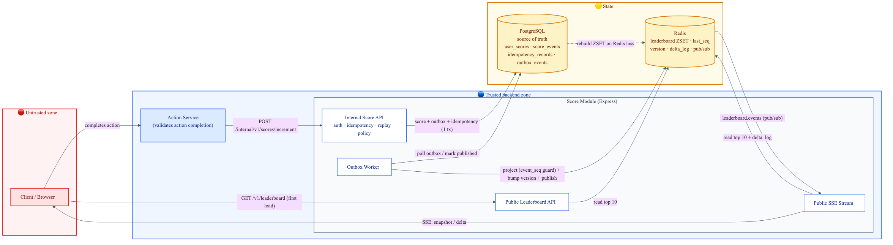
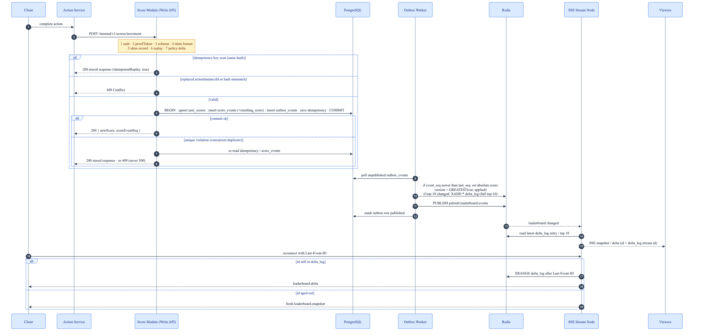
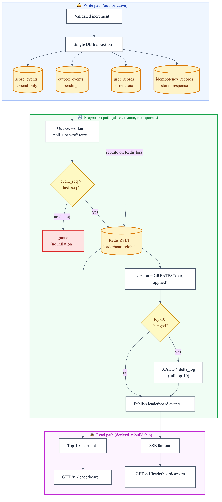

# Problem 6: Scoreboard Service (a Tamper-Resistant Live Top-10)

## 1. What we're building (and what we're not)

### The job

A backend service that:

1. Serves a correct top-10 ranking on demand.
2. Streams changes to that ranking as they happen.
3. Only moves a score when a real, authorized action was completed.
4. Shrugs off replays and any attempt to fake or inflate points.

### Ground rules

- We don't care what the "action" actually is: a match win, a daily check-in, a finished quiz, whatever. That logic lives elsewhere.
- The document is written to be handed straight to the implementing engineers.
- When correctness and abuse-resistance pull against convenience, correctness wins.

### Explicitly out of scope

- Anything visual or frontend.
- The rules that decide when an action counts.
- Multi-region / geo-distributed topology.

### Working assumptions

- The score write is triggered by another backend service (the Action Service), not by the browser directly.
- Reading the leaderboard is open to the public, guarded only by abuse limits.
- `proofToken` starts optional while the only caller is a trusted internal service; it flips to required the moment a less-trusted caller can hit the write path.
- **Exactly one outbox worker runs at a time.** The version update, the `user_last_seq` guard, and the "did the top-10 change?" check all read and write shared, *global* Redis state (the single leaderboard, its version, its delta log), so two workers would race no matter how you divide users between them. Run one worker, with a standby that only takes over on failure. The API and read/stream layers still scale out freely; this limit is only on the projection worker. (If one worker ever can't keep up, the way to scale is to shard the leaderboard itself (see Appendix A), not to add workers to one board.)

## 2. The shape of the system

### Decisions that drive everything else

- Postgres owns the truth: current scores plus the full history of what changed them.
- Redis holds a read-optimized copy of the ranking: fast, but disposable.
- A transactional outbox is what keeps Redis honestly in step with Postgres.
- Clients get their live feed over Server-Sent Events (SSE).
- The point value is looked up server-side from policy. The caller never gets to name a number.

### Who trusts whom

- The client is trusted for nothing regarding scores: not the amount, not the legitimacy.
- The Action Service is the one that confirms an action really finished, then fires the internal score command.
- The Score Module re-checks caller identity, replay, and idempotency before it writes a single row.
- Redis and SSE only distribute state. Neither is ever the authority.



## 3. Data model and the rules it must never break

### Postgres (the authority)

**`user_scores`**: each user's current running total (one row per user).

| Column          | Notes                    |
| --------------- | ------------------------ |
| `user_id`       | primary key              |
| `current_score` | defaults to `0`          |
| `updated_at`    | last time it changed     |

**`score_events`**: append-only history, one row per counted action completion.

| Column               | Notes                                     |
| -------------------- | ----------------------------------------- |
| `event_seq`          | primary key; the global order of changes  |
| `user_id`            |                                           |
| `action_id`          | which action type                         |
| `action_instance_id` | this specific completion                  |
| `score_delta`        | server-decided, never client-sent         |
| `resulting_score`    | the user's total *after* this event; what the worker writes to the ZSET |
| `created_at`         |                                           |

> Unique `(user_id, action_instance_id)`: the business replay guard; the same completion can never be counted twice.

**`idempotency_records`**: remembers responses so retries return the same answer.

| Column            | Notes                                        |
| ----------------- | -------------------------------------------- |
| `user_id`         | part of primary key                          |
| `idempotency_key` | part of primary key                          |
| `request_hash`    | detects the key reused with a different body |
| `response_body`   | what we returned the first time              |
| `created_at`      |                                              |

> Unique `(user_id, idempotency_key)`: dedupes transport-level retries.

**`outbox_events`**: durable hand-off from a committed transaction to Redis.

| Column          | Notes                              |
| --------------- | ---------------------------------- |
| `id`            | primary key                        |
| `event_seq`     | links back to `score_events`       |
| `event_type`    |                                    |
| `payload`       | includes `user_id`, `event_seq`, `resulting_score`: everything the worker needs, so it never reads back from `score_events` |
| `published_at`  | `NULL` = not yet sent to Redis     |
| `attempt_count` | retry counter                      |
| `last_error`    | last failure reason, for debugging |

> Index `(published_at, event_seq)` keeps the worker's polling query cheap: it selects unpublished rows (`published_at IS NULL`) in global `event_seq` order.

### Redis (the derived copy)

| Key                          | Type    | What it holds                                                  |
| ---------------------------- | ------- | -------------------------------------------------------------- |
| `leaderboard:global`         | ZSET    | member = `user_id`, score = the user's current total (absolute, not a running `+delta`); top 10 is instant |
| `leaderboard:user_last_seq`  | HASH    | per user, the highest `event_seq` already applied              |
| `leaderboard:version`        | STRING  | a "how fresh" number shown to clients: the highest `event_seq` now reflected in the board. Set to `GREATEST(current, applied)` so it never goes down. It is **not** used to resume the live stream. |
| `leaderboard:delta_log`      | STREAM  | a short, size-capped (`MAXLEN ~N`) log of top-10 changes, one entry per change, each holding the full top-10. Redis gives each entry an id that always goes up; **that id is what the live stream resumes from** (`Last-Event-ID`). |
| `pubsub:leaderboard:events`  | channel | tells the stream nodes "the board changed, go read the latest"  |

> **Why we keep two separate numbers.** When the worker applies an event it updates the ZSET and sets `leaderboard:version = GREATEST(current, applied event_seq)`. Then, **if the top-10 actually changed**, it adds one entry (the full top-10) to `leaderboard:delta_log` with `XADD *`, letting Redis assign the id. The live stream uses that delta_log id as the SSE event `id`, not `leaderboardVersion`.
>
> The reason: `leaderboardVersion` can stall. If a lower `event_seq` is applied after a higher one, the max doesn't move, so two different top-10 states can end up sharing the same version, which makes it useless for resuming. The delta_log id, on the other hand, goes up on every top-10 change, so a reconnecting client can never miss one. `leaderboardVersion` stays around only as a friendly freshness number in payloads. (See the [glossary](#glossary) for how these values relate.)

### Invariants (non-negotiable)

| # | Rule | Why it matters |
| - | ---- | -------------- |
| 1 | Postgres is authoritative; Redis is disposable and rebuildable. | Losing Redis is a speed problem, never a data-loss problem. |
| 2 | The `score_events` insert, the `user_scores` update, the `outbox_events` insert, **and** the `idempotency_records` write all commit in the *same* transaction: all four or none. | No state where the score moved but the update note or the idempotency record was lost (see §6 step 8 for why the idempotency record must be inside the tx). |
| 3 | A repeated `action_instance_id` never touches a score. | Same completion can't be counted twice (business replay). |
| 4 | Same `idempotency_key` + same payload hash → return the stored first response. | Safe retries: same request, same answer, no double-count. |
| 5 | Same `idempotency_key` + *different* payload hash → `409 Conflict`. | Catches a key being reused for a different request. |
| 6 | Outbox may deliver more than once; a stale `event_seq` is simply ignored. | At-least-once delivery can't inflate the leaderboard. |

## 4. How a score change travels

### 4.1 Full lifecycle



### 4.2 How data flows into the read model



### 4.3 What happens when things go wrong

- Fail closed: a failed check writes nothing: no `score_events`, no `user_scores` bump, no `outbox_events`.
- Reads and the live stream are eventually consistent; both converge on committed DB state once the outbox drains.
- If Redis is down, writes still succeed; the projection just catches up afterward.
- Replaying an outbox row can't inflate anything, because an out-of-date `event_seq` is dropped on arrival.
- **Rebuilding Redis from scratch:** the ZSET is seeded from `user_scores`, and the high-water marks are re-derived from `score_events`: `leaderboard:version` from the global `MAX(event_seq)` and each `user_last_seq` from `MAX(event_seq)` per user. (`user_scores` alone can't seed these, it stores no sequence, so `score_events` is the source for both.)

## 5. API contracts

### 5.1 Internal score increment

`POST /internal/v1/scores/increment`

Applies exactly one validated action completion.

Auth:

- Requires service-to-service identity: internal JWT or mTLS, your call.

Request body:

```json
{
  "userId": "u123",
  "actionId": "daily-checkin",
  "actionInstanceId": "61f01e53-d4af-4f49-a84f-0298e5e0213e",
  "idempotencyKey": "8c36d9b0-5f29-4317-9b90-6d3c0242ad55",
  "proofToken": "optional-signed-proof-token"
}
```

Worth noting:

- `proofToken` is optional *only* while the write path is unreachable from the internet and the sole caller is the trusted-internal Action Service. It becomes **mandatory** the moment any internet-reachable or less-trusted path can hit this endpoint. At that point network topology is no longer a sufficient control for requirement #5.
- When present it is verified early (§6, step 2), before any work is done on the request.
- The delta is never sent by the caller. Full stop.

Success (`200 OK`):

```json
{
  "status": "ok",
  "data": {
    "userId": "u123",
    "actionInstanceId": "61f01e53-d4af-4f49-a84f-0298e5e0213e",
    "appliedScoreDelta": 10,
    "newScore": 980,
    "scoreEventSeq": 102938,
    "idempotentReplay": false
  }
}
```

Replay (`200 OK`):

- Identical body, but `idempotentReplay: true`.

### 5.2 Public leaderboard snapshot

`GET /v1/leaderboard?limit=10`

- Open to the public.
- Rate-limited per IP / user-agent.
- `limit` defaults to `10`, caps at `100`.
- Sorted by score, high to low; ties fall back to Redis member order unless a tie-break policy is turned on.

Success (`200 OK`):

```json
{
  "generatedAt": "2026-03-08T09:30:00.000Z",
  "leaderboardVersion": 102938,
  "entries": [
    { "rank": 1, "userId": "u1", "score": 9820 },
    { "rank": 2, "userId": "u2", "score": 9640 }
  ]
}
```

### 5.3 Public live stream (SSE)

`GET /v1/leaderboard/stream`

- Public, with rate limits and a per-IP cap on simultaneous connections.
- Headers: `Content-Type: text/event-stream`, `Cache-Control: no-cache`, `Connection: keep-alive`.
- Event types: `leaderboard.snapshot`, `leaderboard.delta`, `heartbeat`.

Stream contract:

- Every event's SSE `id` is the `leaderboard:delta_log` entry id, a value that always goes up, written on *every* top-10 change (see §3 for why this, and not `leaderboardVersion`, is what we resume from).
- On reconnect the client sends its `Last-Event-ID`; the server sends back the `leaderboard:delta_log` entries *after* that id (`XRANGE (<id> +`).
- If that id is too old to still be in the log (it fell off the size-capped end), the server can't safely resume, so it sends a fresh `leaderboard.snapshot` instead.
- A `leaderboard.snapshot` (both the fallback above and the one sent on first connect) carries the **latest** `leaderboard:delta_log` id as its SSE `id`, so the client's *next* reconnect has a valid point to resume from. On a brand-new system where the log is still empty, use `0-0`; a later reconnect then resumes with `XRANGE (0-0 +`, which returns everything from the start.
- `entries` always holds the **full current top-10**, so a client can draw the board from a single event without keeping any prior state. `leaderboardVersion` is just a freshness number, and `changedUserId` only highlights who moved.
- The worker is the **only** thing that builds deltas: it writes both the full top-10 (`entries`) and `changedUserId` into each `delta_log` entry. Stream nodes never build their own; they just forward what the worker wrote (or, on a nudge with nothing new to replay, re-read the top-10). This stops two nodes from disagreeing about `changedUserId`.

Example delta (`eventId` shown for illustration; on the wire it is the SSE `id:` field):

```json
{
  "eventId": "1709889000123-0",
  "type": "leaderboard.delta",
  "leaderboardVersion": 102939,
  "changedUserId": "u18",
  "entries": [
    { "rank": 1, "userId": "u1", "score": 9820 },
    { "rank": 10, "userId": "u18", "score": 9100 }
  ]
}
```

## 6. Errors and the order we validate in

### Order of checks

1. Confirm the internal caller's identity.
2. Verify `proofToken` if policy demands it; an authenticity check runs *before* we do any work on the request.
3. Check the payload shape and required fields.
4. Check the idempotency key is well-formed.
5. Look up the idempotency record:
   - same key, same hash → hand back the stored response.
   - same key, different hash → `409`.
6. Enforce the replay guard on `(user_id, action_instance_id)`.
7. Run action policy and compute the server-side delta.
8. Do all of the writes in **one transaction**: all of them commit, or none do:
   - First, **upsert** `user_scores`: `INSERT ... ON CONFLICT (user_id) DO UPDATE SET current_score = current_score + :delta`. The upsert creates the row on a user's first-ever score *and* locks it against other writers, so two increments for the same user are always handled one at a time, even the very first two, where there is no row to lock yet. Read back the new total.
   - Then insert `score_events`: this assigns `event_seq` and also stores the new total in `resulting_score`. Then insert `outbox_events` (carrying `user_id`, `event_seq`, and `resulting_score`), and write the `idempotency_records` entry.

   Because the upsert runs first and holds the row, a user's events get their `event_seq` in commit order, so the event with the highest `event_seq` also holds that user's latest total. (This is what lets the worker apply events out of order safely, see §7.)

   The idempotency record must be inside this same transaction. If it were written afterward and the process crashed in between, a normal retry would hit the replay guard and get a `409` instead of the stored `200`.

> **What if two identical requests arrive at the same time?** Steps 5 and 6 only *read* (they don't lock), so two duplicates can both get past them before either has committed. The database unique constraints are what actually keep them apart: the second transaction to commit fails with a unique-constraint error (on `score_events` or `idempotency_records`; the `user_scores` upsert never throws). Handle that error on purpose; don't let it turn into a `500` (a `500` just makes the caller retry yet again). When a transaction fails this way, roll it back and work out the answer by reading what the winning request already committed:
>
> 1. Read `idempotency_records` for this `(user_id, idempotency_key)`. If a row is there, compare its `request_hash` with this request: **same hash → return the stored `200`; different hash → `409`.** (The hash is still checked here, exactly like step 5.)
> 2. If no such row, read `score_events` for this `(user_id, action_instance_id)`. If a row is there, this is a replay under a different key → `409`.
>
> One trap to avoid: if you insert `score_events` with `ON CONFLICT DO NOTHING` (to lean on the replay guard), check whether a row was actually inserted (e.g. with `RETURNING`). If it wasn't, **roll back the whole transaction**; otherwise the `user_scores` upsert you already did leaves the score raised while the event insert quietly did nothing.

### Status codes

- `400`: malformed body or bad field format.
- `401`: internal caller auth missing or invalid.
- `403`: proof token invalid, or required and absent.
- `409`: replayed `actionInstanceId`, or an idempotency hash mismatch.
- `500`: something broke that shouldn't have.

> The internal increment endpoint is service-to-service and is **not** rate-limited, so it never returns `429`. `429` applies only to the public read/stream endpoints (§5.2, §5.3).

## 7. Build checklist

### Storage / constraints

- Add the unique constraints on `(user_id, action_instance_id)` and `(user_id, idempotency_key)`.
- Index `outbox_events (published_at, event_seq)` so the worker's poll stays cheap.
- Keep the score write, the outbox insert, **and** the idempotency-record write in one transaction, always.
- Handle the unique-violation race on concurrent duplicates by re-reading and returning the stored result, never `500` (see §6).

### Outbox / projection

- Run **one** worker (see the assumption in §1). A standby that only takes over on failure is fine; two active workers are not.
- Give the worker retries with backoff for rows that fail.
- Write the payload's `resulting_score` (the user's **absolute** total, not a `+delta`) into the ZSET, and only when the event's `event_seq` beats the stored `user_last_seq`. Because a user's highest `event_seq` always carries their latest total (§6, step 8), applying events out of order still lands on the right score.
- In the same step, set `leaderboard:version = GREATEST(current, applied)`, and, **whenever the top-10 changed**, `XADD *` one full-top-10 entry (with `changedUserId`) to `leaderboard:delta_log`. The trigger is "top-10 changed," not "version went up," so no change ever gets left out of the resume log.
- Publish the "leaderboard changed" signal only after the projection has landed.

### Streaming

- Do not recompute deltas in the stream node; fan out exactly what the worker wrote to `leaderboard:delta_log`. Deltas carry the full top-10, so a client never needs prior state to render.
- Send periodic heartbeats.
- Honor `Last-Event-ID` on reconnect by replaying `leaderboard:delta_log` entries after that stream id (`XRANGE (<id> +`).
- Drop back to a full snapshot whenever the requested id has already aged out of `leaderboard:delta_log`.

### Observability

- Metrics: responses by status, replay rejections, idempotency-hit rate, outbox backlog, projection lag, live SSE connections.
- Trace the whole write path: internal API → DB tx → outbox → Redis → SSE.
- Alert on: outbox lag that won't drain, stream-lag spikes, and sudden jumps in replay rejections.

### Tests that must pass

1. A duplicate `actionInstanceId` leaves the score untouched.
2. Same `idempotencyKey` + same payload replays the earlier response.
3. Same `idempotencyKey` + different payload returns `409`.
4. Re-delivered outbox rows don't inflate the board.
5. Redis can be down for writes and still catch up later.
6. SSE reconnect either resumes from `Last-Event-ID` or gets a snapshot fallback.
7. Public reads actually enforce their rate and connection caps.
8. Two concurrent duplicate increments (same key, in-flight together) yield exactly one score change and the *same* stored response, not a `500`.
9. When the worker applies an out-of-order event that changes the top-10 without advancing `leaderboardVersion`, the change still lands in `delta_log`, and a client reconnecting afterward sees the current top-10 (never a stale one).

## Glossary

A few values here all sound like "order," but they do different jobs. The one that trips people up most is which value you can safely resume the live stream from, so that's called out below.

| Name | Where it lives | What it's for |
| ---- | -------------- | ------------- |
| `event_seq` | `score_events` primary key (Postgres) | The order in which counted actions were recorded. The source of truth. |
| `scoreEventSeq` | increment API response | The `event_seq` for *this* write, sent back to the caller. |
| `user_last_seq` | Redis HASH | The highest `event_seq` already applied for one user. Lets the worker safely ignore a re-delivered event. |
| `leaderboardVersion` | Redis `leaderboard:version`, read/stream payloads | A freshness number for clients. Can stall, so it is **not** used to resume the stream. |
| delta_log id | `leaderboard:delta_log` entry id, SSE `id` / `Last-Event-ID` | **What the live stream resumes from.** Always goes up, one per top-10 change. |

> **A note on ordering.** `event_seq` is handed out when a row is inserted, but transactions can commit in a different order, so the worker might see event 102 before 101. Two things keep this safe. First, for a single user, the write transaction takes the user's row lock *before* inserting into `score_events` (see §6, step 8), so that user's events get their `event_seq` in commit order: the highest `event_seq` is always the latest score. Second, the worker writes the user's *absolute* score into the ZSET (not a `+delta`) and only when the event's `event_seq` beats `user_last_seq`, so applying events out of order still lands on the correct total. `leaderboardVersion` uses `GREATEST(...)` so it never drops, but it can stall, which is why the live stream resumes from the delta_log id, not the version.

## Appendix A: Things we'd do later (not day one)

- Swap outbox polling for CDC (logical decoding / Debezium) if polling latency or DB load starts to hurt.
- Add a real tie-break rule for equal scores, e.g. first to reach the score ranks higher.
- Shard the board by mode or region if one global ZSET ever becomes the bottleneck.
